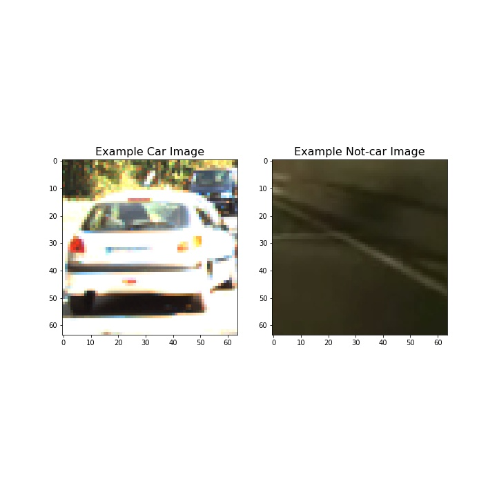
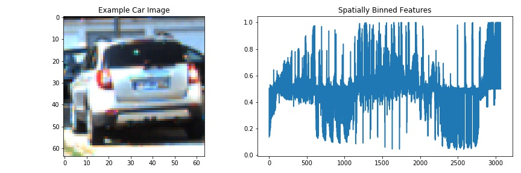
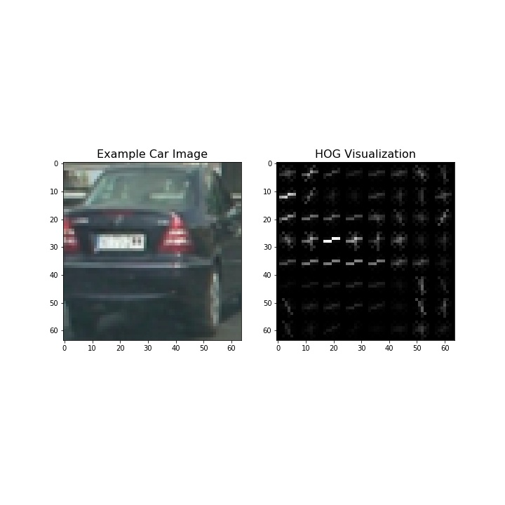
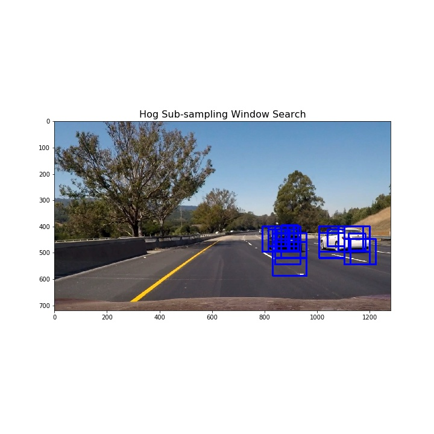
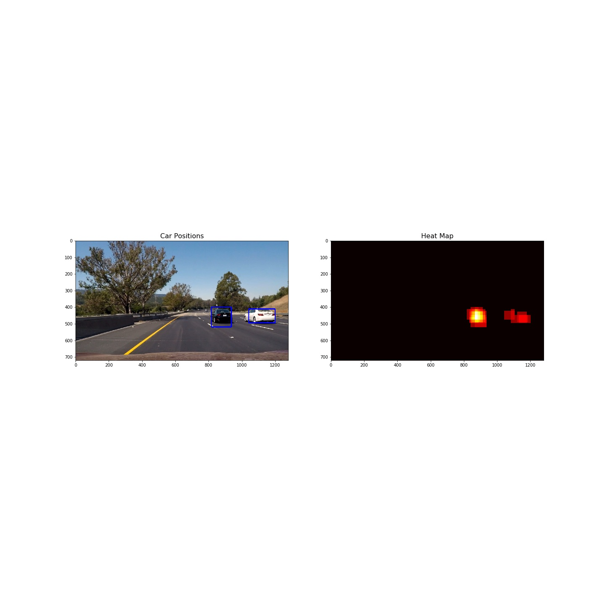
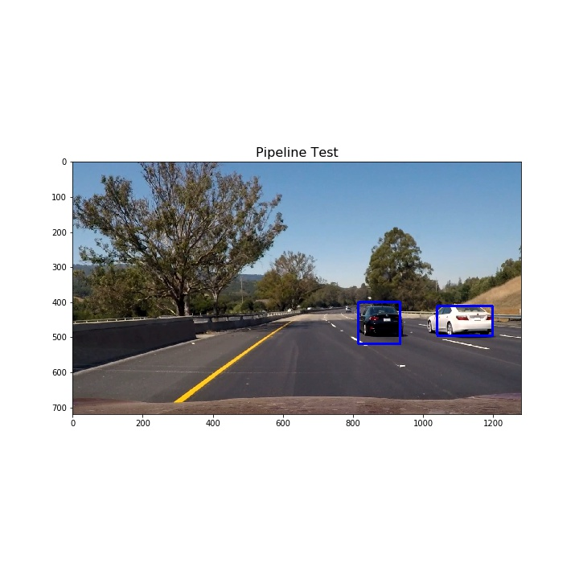

# **Vehicle Detection and Tracking**

## Project Writeup

---

### Vehicle Detection Project ###

The goals / steps of this project are the following:
* Perform a [Histogram of Oriented Gradients (HOG)](http://scikit-image.org/docs/dev/auto_examples/features_detection/plot_hog.html) feature extraction on a labeled training set of images and train a classifier Linear SVM classifier
* Apply a color transform and append binned color features, as well as histograms of color, to your HOG feature vector (optionally).
* Normalize extracted features and randomize a selection for training and testing.
* Implement a sliding-window technique and use the trained classifier to search for vehicles in images.
* Run the pipeline on a video stream (start with the [test_video.mp4](test_video.mp4) and later implement on full [project_video.mp4](project_video.mp4) and create a heat map of recurring detections frame by frame to reject outliers and follow detected vehicles.
* Estimate a bounding box for vehicles detected.

The actual project code with solution is provided in the IPython notebook [vehicle_detection.ipynb](vehicle_detection.ipynb) and python modules in [p5lib/](p5lib/) folder. The majority of the project code was adopted from the class examples and quizes.  

---

## [Rubric](https://review.udacity.com/#!/rubrics/513/view) Points ##
### Here I will consider the rubric points individually and describe how I addressed each point in my implementation. ### 

---

## Histogram of Oriented Gradients (HOG) ##

**1. Explain how (and identify where in your code) you extracted HOG features from the training images.**

I started by reading in all the vehicle and non-vehicle images. The code for this step is in cells `1, 2 and 3` and the helper functions are in python modules [data_preparation.py](p5lib/data_preparation.py) and [visualize.py](p5lib/visualize.py) located in [p5lib/](p5lib/) folder.   
In total I loaded `8792 vehicle` and `8968 non-vehicle` image files, each image of size `(64, 64, 3)` and data type `float32`. 
I also suffled the files to avoid a potential bias of similar images. 

Here is an example of one of the vehicle and non-vehicle classes:

I then explored different color spaces and different `skimage.hog()` parameters (`orientations`, `pixels_per_cell`, and `cells_per_block`). I grabbed random images from each of the two classes and displayed them to get a feel for what the skimage.hog() output looks like. The code is in cells `4` and `5` of the notebook and python module [features.py](p5lib/features.py).

Here is an example using the `YCrCb` color space and HOG parameters of `orientations=9`, `pixels_per_cell=(8, 8)` and `cells_per_block=(2, 2)`:

**2. Explain how you settled on your final choice of HOG parameters.**

I tried various combinations of parameters and ended up with choice of all three channels from the `YCrCb` color space with HOG parameters of `orientations=9`, `pixels_per_cell=(8, 8)` and `cells_per_block=(2, 2)`. This combination gave me a good test accuracy on the linear SVM model. 

**3. Describe how (and identify where in your code) you trained a classifier using your selected HOG features (and color features if you used them).**

I extracted `combined` HOG features using the above set of HOG parameters and color space and also extraxted `spatial` features resizing the dataset images to size of `32x32` pixels and converting to one-dimentional array using `ravel()` method from `OpenCV` library. The code of this step is in the notebook cell `6` and the python module [features.py](p5lib/features.py). 

In total I extracted 8792 car features and 8968 non-car features. I normalized the features with `sklearn.preprocessing.StandardScaler()` and split into `14208` train data feature and `3552` test features using `sklearn.model_selection.train_test_split()` - cells `7` and `8` of the notebook. 

A challenging part was to find a way of scaling the extracted features. I used a mothod suggested in this [forum](https://discussions.udacity.com/t/extract-hog-features-just-once-for-the-entire-region-of-interest-in-each-full-image-video-frame/458672) post to scale the extracted features to the range from 0 to 1 to avoid potential dominance of some of the features. Only after that I could get good training results.

I trained the classifier using Linear SVM and the best train accuracy was 0.9927. The code of this step is in the notebook cell `9`. I saved the classifier and the training parameters in `pickle` file `linear_svc_pickle.p` for later use.

## Sliding Window Search ##

**1. Describe how (and identify where in your code) you implemented a sliding window search. How did you decide what scales to search and how much to overlap windows?**

I used HOG sub-sampling window search to find vehicles in the images. The code of this step is in the notebook cells `12` and `13` and the python module [detection.py](p5lib/detection.py). To get enough overlapping bounding boxes for the detected cars I used 3 different scales of the sliding windows: `1.0`, `1.5` and `2.0`. Here is an example:

The below table shows the setting for multi-scale window search:

| ystart | ystop | scale | 
|:------:|:------:|:----:| 
|380|580|1.0|
|400|600|1.5|
|460|660|2.0|

I created heatmaps by combining the overlapped boxes and thresholded the heatmap to exclude false positives. Then I used `scipy.ndimage.measurements.label` function to identify individual blobs in the heatmap. Then I constructed bounding boxes to cover the area of each blob detected. Here is an example:

**2. Show some examples of test images to demonstrate how your pipeline is working. What did you do to optimize the performance of your classifier?**

I searched for cars on 3 scales using YCrCb 3-channel HOG features plus spatially binned color and histograms of color in the feature vector. Here is an example test image:

## Video Implementation ##

**1. Provide a link to your final video output. Your pipeline should perform reasonably well on the entire project video (somewhat wobbly or unstable bounding boxes are ok as long as you are identifying the vehicles most of the time with minimal false positives.)**

Here's a [link to my video result](project_video_output.mp4)

## Discussion ##

**1. Briefly discuss any problems / issues you faced in your implementation of this project. Where will your pipeline likely fail? What could you do to make it more robust?**

Here I'll talk about the approach I took, what techniques I used, what worked and why, where the pipeline might fail and how I might improve it if I were going to pursue this project further.

First, I have to admit that my final output video does not look great. Even so the classifier training accuracy was high enough, the video processing pipeline requires more work in order to get better results.

Second, I was expressed by the performance of the Linear SVM classifier. Actually I also tried SVM parameter tuning by running GridSearchCV for a simple choice of kernel and C. It took ages to complete the tuning and the resulting classifier was so big that made it alsolutely not practical to use. The Linear SVM classifier is really light and fast, but it also requires a proper nomalization of the input data to get good result. Also the sub-sampling and heatmap thresholding is an elegant method that can be applied to a wide variety of tasks. 

In conclusion I am thankful for that exciting journey and I wish to have more time to get better results.  
